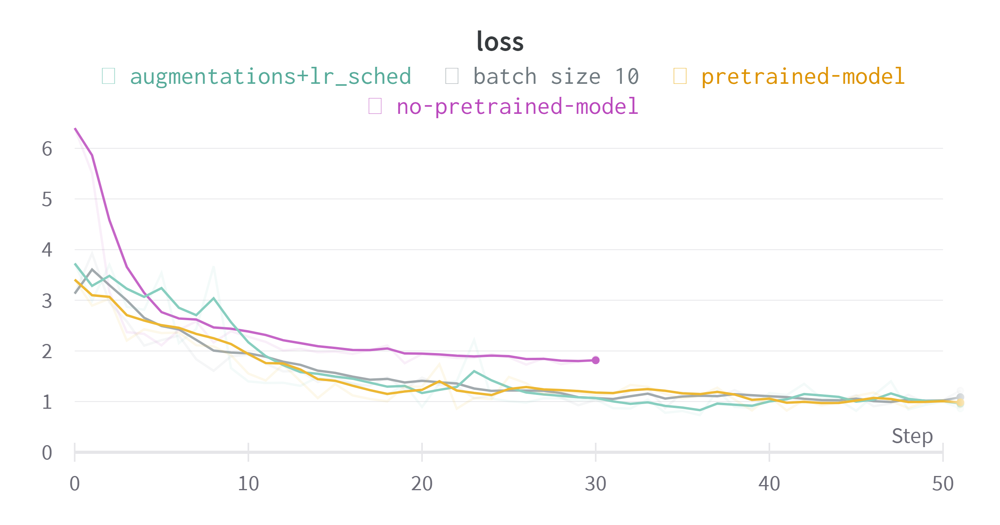
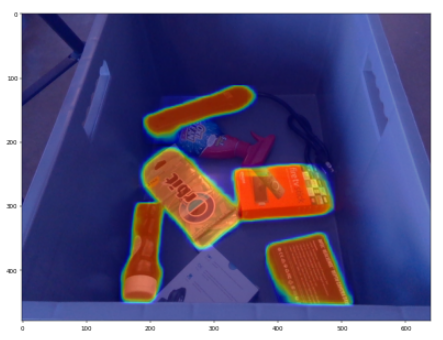

# Robotic-Gripping-Detection

# Overview

To solve this challenge I have trained a MaskRCNN pytorch model to detect ideal gripping surfaces. The input was rgbd images (depth was cancatenated to the color images) and the model was finetuned on the given training set. To account for that I swapped out the first conv layer and the bottom head layers. I tried a bunch of augmentations but the performance surpisingly went down, so I didnt include it in the final solution. I tried multiple hyperparameters and visualized the results on WandB. The loss plot for a few runs is attached below.



<br>

## Model outputs (Test Set)

<br>


<br><br><br>
All the resultant outputs from the Test Set can be found in the <b>infer</b> folder
<br><br><br>

# To Run the code

Important Links -

0. Model weights - https://drive.google.com/drive/folders/1EWE7eVpRTGgKL_jTD3hANJC_UMFzldYW?usp=sharing

1. Download the weight file from the Drive link and put it in the weights folder
2. Put the data folder from the challenge in the same directory as this code.
3. To train a new model or restart from checkpoint -

   <br>

```
 python train.py --wb 0 --save_chkpt "../weights"
 --load_chkpt "../weights/maskrcnn_53.pt" --output_viz "../outs"

```

4. To run the code on the Test set and generate heatmap outputs

   <br>

```
 python infer.py --wb 0 --load_chkpt "../weights/maskrcnn_53.pt" --output_viz "../infer"
```

# Improvements

## 1. Using 'stuff' masks to isolate objects


<br><br>

Since the preference in this problem is to achieve higher precision, it may make sense to first isolate all the objects to reduce the chances of False Positives being detected on the flat background of the tray.
This happens a few times for my current model. For instance in the image below. Eliminating these FPs can improve precision. One way to do that
can be to use a generic object detector to segment out objects of interest. In the example below I used a MaskRCNN trained on COCO to segment out objects. However, the 91 classes of COCO are not expressive enough for our problem as they dont encompass all possible objects. Nonetheless, training one shouldnt be too hard given an annotated dataset.

|   Model Prediction    | Mask predicted by generic object detector |
| :-------------------: | :---------------------------------------: |
|  |                     |

## 2. Convolving a diff filter on the depth mask

A diff filter can be convolved to check how rapidly depth values change over a predetermined grid. This grid can roughly have the same dimensions as the robotic arm. If depth values remain relatively constant across a path, then it can be assumed to be flat surface. This information can be combined with a pretrained object segmenter to generate quick, easy and accurate heatmaps.

## 3. Projecting in 3D

Assuming that we have access to the camera matrices, we can project the scene into a 3d representation, for instance a point cloud. We can then do segmentation in the 3D space using a pointNet++ style model, which throretically should me more accurate since it leverages the 3d structure of the object. We can also compute the surface normals, which can give us an idea of the orientation of the surface of these objects. If the orientation of the normals is changing drastically over a localized region, it probably means that its not a flat surface.
